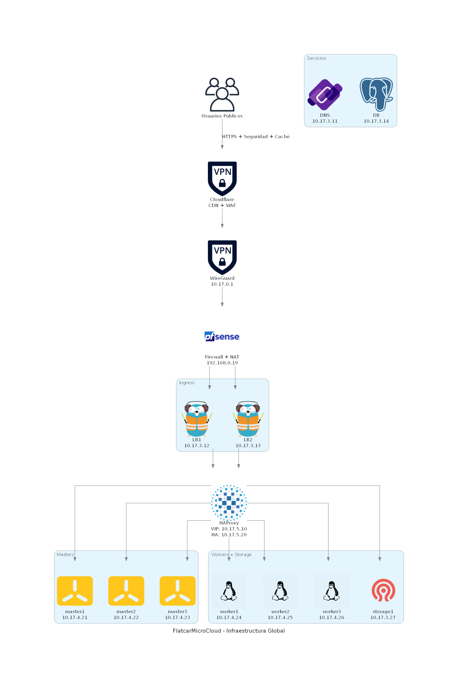
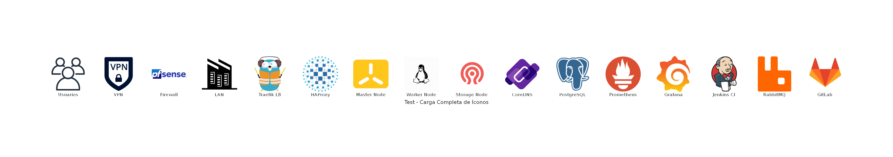

# FlatcarMicroCloud - Arquitectura de Infraestructura

Este repositorio contiene el diagrama de arquitectura de **FlatcarMicroCloud**, representado utilizando la librería [`diagrams`](https://diagrams.mingrammer.com/) de Mingrammer.

---

## 📌 Descripción

FlatcarMicroCloud es una infraestructura optimizada para Kubernetes, diseñada con seguridad, escalabilidad y eficiencia. El diagrama generado muestra la estructura de red, balanceo de carga, seguridad y nodos del clúster.

---

## 🚀 Instalación y Uso

### 1️⃣ Clonar el repositorio

Clona este repositorio en tu máquina local:

```sh
git clone https://github.com/vhgalvez/arquitectura_FlatcarMicroCloud.git
cd arquitectura_FlatcarMicroCloud
```

### 2️⃣ Instalar dependencias

Necesitas tener **Python 3.x** y **Graphviz** instalado:

```sh
pip install diagrams
```

#### Instalar graphviz según tu sistema

- **Ubuntu/Debian**:

  ```sh
  sudo apt install graphviz
  ```

- **macOS (Homebrew)**:

  ```sh
  brew install graphviz
  ```

- **Windows**:

  Descarga e instala Graphviz desde [graphviz.org](https://graphviz.gitlab.io/download/).

### 3️⃣ Generar el diagrama

Ejecuta el script principal para generar la imagen:

```sh
python arquitectura_FlatcarMicroCloud.py
```

Esto generará un archivo `FlatcarMicroCloud - Infraestructura Global.png` con la arquitectura visualizada.

---

## 🏗️ Arquitectura de la Infraestructura

### 📡 Usuarios Públicos y Seguridad Externa

- **Usuarios Públicos** acceden mediante **Cloudflare CDN**, que actúa como proxy y caché.
- **VPS con IP Pública** expone servicios de forma segura a través de **WireGuard VPN Gateway**.

### 🔀 Balanceo de Carga

- **Traefik Load Balancers** manejan el tráfico interno.
- Integración con **Kubernetes y FreeIPA**.

### 🖥️ Infraestructura Base

- **Bastion Node**: Control de acceso seguro.
- **FreeIPA Node**: Autenticación y DNS.
- **PostgreSQL Node**: Base de datos principal.

### ☸️ Clúster Kubernetes

- **3 Master Nodes (etcd)**: Control y coordinación del clúster.
- **3 Worker Nodes**: Procesamiento y ejecución de contenedores.
- **Storage Node**: Almacenamiento distribuido.

---

## 📊 Scripts Disponibles

### arquitectura_FlatcarMicroCloud.py

Genera el diagrama principal de la infraestructura global, incluyendo:

- Usuarios públicos y seguridad externa.
- Balanceadores de carga (Traefik y HAProxy).
- Nodos maestros y trabajadores de Kubernetes.
- Nodo de almacenamiento.

### carga_completa_iconos.py

Prueba la carga de íconos disponibles en la librería `diagrams` para verificar compatibilidad y diseño.

---

## 🖼️ Ejemplo de Diagramas Generados

### Infraestructura Global



### Carga Completa de Íconos



---

## 📜 Licencia

Este proyecto está bajo la **Licencia MIT**. Consulta el archivo [LICENSE](LICENSE) para más detalles.

---

📧 **Contacto:** Si tienes dudas o sugerencias, ¡abre un issue o contribuye al proyecto! 🚀


─────────────────────────────────────────────────────────────────────────────


```bash

░░░░░░░░░░░░░░░░░░░░░░░░░░░░░░░░░░░░░░░░░░░░░░░░░░░░░░░░░░░░░░░░░░░░
          ░░ INFRAESTRUCTURA GLOBAL FLATCARMICROCLOUD ░░
░░░░░░░░░░░░░░░░░░░░░░░░░░░░░░░░░░░░░░░░░░░░░░░░░░░░░░░░░░░░░░░░░░░░

                        👥 [Usuarios Públicos]
                                 │
               (HTTPS + Seguridad + Caché vía Cloudflare)
                                 │
                                 ▼
                      +-----------------------------+
                      | 🌐 Cloudflare CDN           |
                      | Proxy + WAF + Anti-DDoS     |
                      +-----------------------------+
                                 │
                                 ▼
                      +-----------------------------------------+
                      | VPS (IP Pública)                        |
                      | WireGuard Gateway                       |
                      | Túnel VPN: 10.17.0.1                    |
                      +-----------------------------------------+
                                 │
                                 ▼
        +---------------------------------------------------------------+
        | Servidor Físico (WireGuard + NAT + nftables)                  |
        | Red LAN: 192.168.0.0/24                                       |
        | IP: 192.168.0.19                                              |
        | Funciones: VPN, NAT, Enrutamiento interno seguro             |
        +---------------------------------------------------------------+
                                 │
               (Redirección a infraestructura interna)
                                 ▼

                ┌──────────────────────────────────────────────┐
                │               Kubernetes Ingress              │
                └──────────────────────────────────────────────┘
                    │                                 │
                    ▼                                 ▼
     +----------------------------------+  +----------------------------------+
     | Load Balancer 1 (Traefik)        |  | Load Balancer 2 (Traefik)        |
     | IP: 10.17.3.12                   |  | IP: 10.17.3.13                   |
     | loadbalancer1.cefaslocalserver.com | loadbalancer2.cefaslocalserver.com |
     +----------------------------------+  +----------------------------------+
                    └────────────────────────┬────────────────────────┘
                                             ▼
             +-----------------------------------------------------------+
             | HAProxy + Keepalived (k8s-api-lb.cefaslocalserver.com)   |
             | VIP: 10.17.5.10                                           |
             | IP Alta Disponibilidad: 10.17.5.20                        |
             +-----------------------------------------------------------+

                                             ▼
        ┌───────────────────────────────────────────────────────────────┐
        │         Kubernetes Control Plane (Master Nodes)               │
        └───────────────────────────────────────────────────────────────┘
             │                   │                     │
             ▼                   ▼                     ▼
  +-------------------------+ +-------------------------+ +-------------------------+
  | master1.cefaslocalserver.com | master2.cefaslocalserver.com | master3.cefaslocalserver.com |
  | IP: 10.17.4.21          | IP: 10.17.4.22          | IP: 10.17.4.23          |
  | (Flatcar / etcd + API) | (Flatcar / etcd)         | (Flatcar / etcd)         |
  +-------------------------+ +-------------------------+ +-------------------------+

        ┌───────────────────────────────────────────────────────────────┐
        │        Kubernetes Worker Nodes + Nodo de Almacenamiento       │
        └───────────────────────────────────────────────────────────────┘
     │                        │                       │                      │
     ▼                        ▼                       ▼                      ▼
+-----------------------+ +-----------------------+ +-----------------------+ +----------------------------+
| worker1.cefaslocalserver.com | worker2.cefaslocalserver.com | worker3.cefaslocalserver.com | storage1.cefaslocalserver.com |
| IP: 10.17.4.24         | IP: 10.17.4.25         | IP: 10.17.4.26         | IP: 10.17.3.27                |
| Flatcar / Longhorn     | Flatcar / Longhorn     | Flatcar / Longhorn     | AlmaLinux / 🐂 Longhorn + 📁 NFS |
+-----------------------+ +-----------------------+ +-----------------------+ +----------------------------+

─────────────────────────────────────────────────────────────────────────────
🧠 Servicios Complementarios (Roles Extra):
─────────────────────────────────────────────────────────────────────────────
+------------------------------------------+   +------------------------------------------+
| CoreDNS (infra-cluster.cefaslocalserver.com) | PostgreSQL (postgresql1.cefaslocalserver.com) |
| IP: 10.17.3.11                           | IP: 10.17.3.14                             |
| DNS interno y sincronización horaria     | Base de datos centralizada para microservicios |
+------------------------------------------+   +------------------------------------------+


```

─────────────────────────────────────────────────────────────────────────────